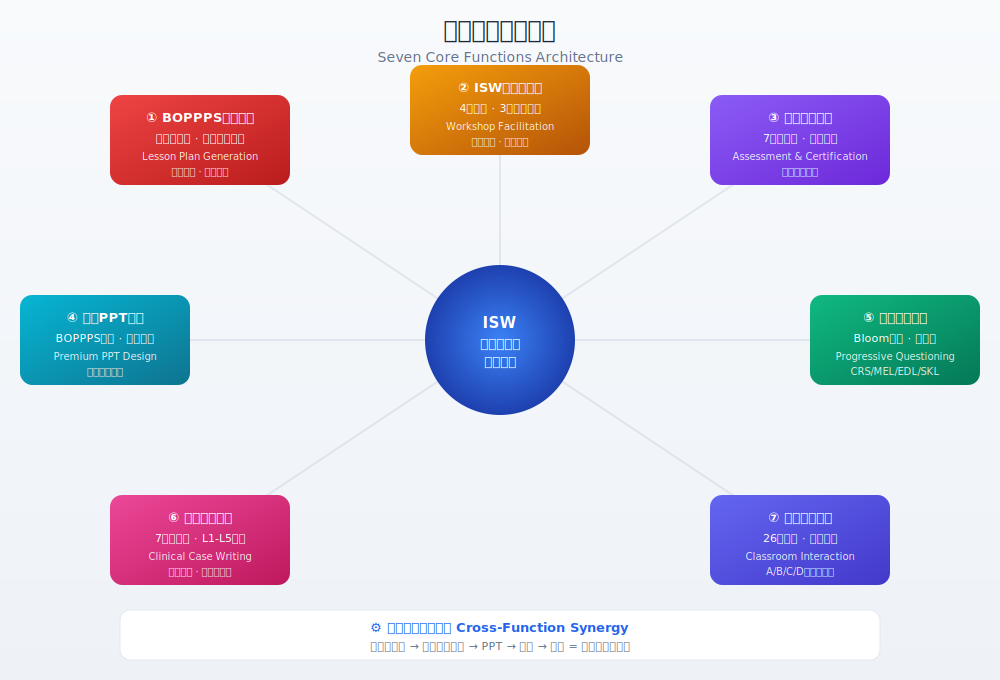
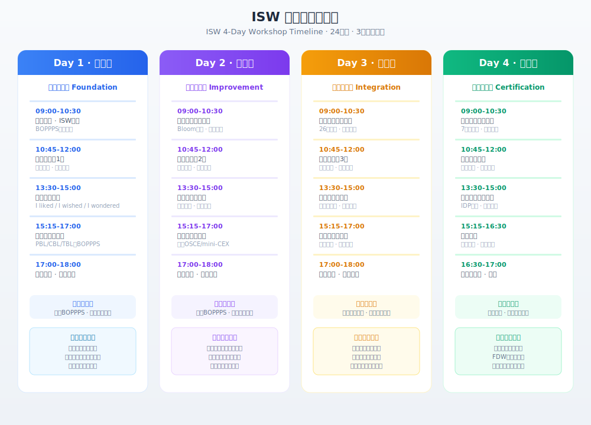
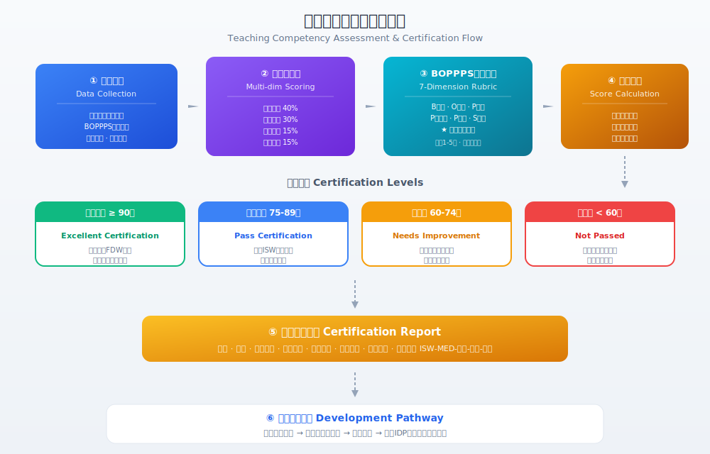
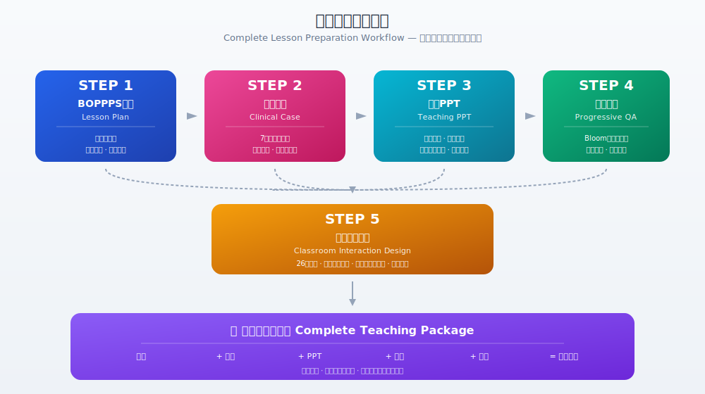

# ISW Medical Teacher Training Skill

# ISW 医学院教师培训技能

[](https://opensource.org/licenses/MIT)
[](https://github.com/abmarkguo/isw-medical-teacher-training)
[](https://github.com/abmarkguo/isw-medical-teacher-training)
[](https://github.com/abmarkguo/isw-medical-teacher-training)
[](#中文介绍)
[](#english-introduction)

> A comprehensive AI-powered skill for **Instructional Skills Workshop (ISW)** training in medical education — BOPPPS lesson plans, workshop facilitation, teaching certification, PPT design, progressive questioning, clinical cases, and classroom interaction.
>
> 面向医学院校的 **ISW（教学技能工作坊）** AI 辅助培训技能 — BOPPPS 教案生成、工作坊引导、教学能力认证、精品 PPT、循序问答、临床案例、课堂互动。

**Keywords:** ISW, Instructional Skills Workshop, BOPPPS, medical education, faculty development, teaching skills, microteaching, lesson plan, PBL, CBL, TBL, simulation, OSCE, mini-CEX, DOPS, clinical case, classroom interaction, AI education, 教学技能工作坊, 教学设计, 医学教育, 微格教学, 教案设计, 临床案例教学

**关键词:** ISW培训, BOPPPS教案, 教学技能工作坊, 微格教学, 医学教育, 临床教学, PBL, CBL, TBL, 模拟教学, OSCE, mini-CEX, 教学PPT, 课堂互动, 教学能力评估, 教师培训, 医学院, 教学设计, 循序问答, 临床案例

---

## English Introduction

### Overview

This skill provides complete ISW training support for medical school faculty, covering seven core functions aligned with international ISW standards and Chinese medical education requirements. It is designed for the [OpenClaw](https://www.codebuddy.cn/) AI assistant platform.

### BOPPPS Model Overview


The BOPPPS six-step model is the core framework of ISW training. This skill adapts each step for medical education with clinical case integration, pedagogy alignment, and medical humanities embedding.

### Seven Core Functions Architecture



| # | Function | Description |
|---|----------|-------------|
| 1 | **BOPPPS Lesson Plan Generation** | Auto-generate medical lesson plans based on the BOPPPS six-step model, with multi-discipline adaptation and clinical case-driven design |
| 2 | **ISW Workshop Facilitation** | Full-workshop support including 3-4 day agendas, micro-teaching design, feedback protocols, and facilitation scripts |
| 3 | **Teaching Competency Assessment & Certification** | Multi-dimensional scoring rubrics, certification reports, and professional development pathways |
| 4 | **Premium Teaching PPT Generation** | Slide-by-slide PPT outlines aligned with BOPPPS, with medical visual standards, cognitive load management, and instructor notes |
| 5 | **Progressive Questioning Design** | Scaffolded question chains based on Bloom's taxonomy, with four medical questioning patterns (CRS/MEL/EDL/SKL) and follow-up strategies |
| 6 | **Detailed Clinical Case Writing** | 7-stage progressive disclosure clinical cases with ethical discussions, cross-disciplinary links, and L1-L5 difficulty levels |
| 7 | **Classroom Interaction Design** | 26 interactive activities across four categories (quick/structured/role-play/tech-enhanced), with full-participation guarantees |

### ISW 4-Day Workshop Timeline



### Assessment & Certification Flow



### Complete Lesson Preparation Workflow



All seven functions can work independently or collaboratively. The workflow above shows how a complete teaching package is generated step by step, starting from a BOPPPS lesson plan.

### Key Features

- **BOPPPS + Medical Pedagogy Integration**: Seamlessly integrates PBL, CBL, TBL, Simulation, and Bedside Teaching with the BOPPPS framework
- **Multi-Discipline Adaptation**: Tailored strategies for Basic Medicine, Clinical Medicine, Nursing, Pharmacy, and Interdisciplinary courses
- **Clinical Case-Driven**: Authentic case-based design following progressive disclosure principles
- **Medical Humanities Integration**: Natural embedding of ethics, doctor-patient communication, and professionalism throughout lesson plans
- **Assessment Tool Alignment**: Pre/post-assessments aligned with OSCE, mini-CEX, DOPS, and other clinical evaluation tools
- **Role-Based Modes**: Three modes for new faculty, experienced teachers, and workshop facilitators
- **Cross-Function Synergy**: All seven functions can work independently or collaboratively for complete course preparation

### Target Users

- **New Medical Faculty**: Clinicians transitioning to teaching roles
- **Experienced Teachers**: Faculty seeking systematic teaching enhancement
- **Faculty Development Centers**: FDW-certified facilitators and educational administrators
- **Medical Education Researchers**: Those studying ISW implementation in medical contexts

### Skill Structure

```
isw-medical-teacher-training/
├── SKILL.md                          # Main instruction file (7 workflows, 3 role modes)
├── README.md                         # This file
├── .gitignore
├── docs/images/                      # Flowchart diagrams
│   ├── boppps-model-flow.svg         # BOPPPS six-step model flowchart
│   ├── seven-functions-architecture.svg # Seven functions architecture diagram
│   ├── isw-workshop-timeline.svg     # 4-day workshop timeline
│   ├── assessment-certification-flow.svg # Assessment & certification flowchart
│   └── complete-prep-workflow.svg    # Complete lesson preparation workflow
├── references/                       # Reference documents (loaded on demand)
│   ├── isw-standards.md              # ISW international/domestic standards
│   ├── boppps-model-guide.md         # BOPPPS six-step model detailed guide
│   ├── medical-teaching-methods.md   # PBL/CBL/TBL/Simulation integration
│   ├── assessment-rubrics.md         # Teaching competency assessment rubrics
│   ├── discipline-templates.md       # Multi-discipline adaptation guide
│   ├── ppt-design-guide.md           # PPT design principles for medical education
│   ├── progressive-qa-guide.md       # Progressive questioning methodology
│   ├── clinical-case-design.md       # Clinical case writing standards
│   └── classroom-interaction-guide.md # Classroom interaction activity library
└── assets/                           # Output templates
    ├── lesson-plan-template.md       # BOPPPS lesson plan template
    ├── workshop-agenda-template.md   # ISW workshop agenda template
    ├── micro-teaching-feedback.md    # Micro-teaching feedback form
    ├── assessment-scorecard.md       # Teaching competency scorecard
    ├── certification-report.md       # Certification report template
    ├── ppt-outline-template.md       # PPT slide-by-slide outline template
    ├── progressive-qa-template.md    # Progressive Q&A chain template
    ├── clinical-case-template.md     # Detailed clinical case template
    └── classroom-interaction-template.md # Classroom interaction plan template
```

### How to Use

#### Option A: Install via OpenClaw

1. Download or clone this repository
2. Copy the `isw-medical-teacher-training` folder to `~/.openclaw/skills/`
3. Restart OpenClaw — the skill will be available automatically
4. Trigger by mentioning keywords like "ISW培训", "BOPPPS教案", "教学PPT", "临床案例", "课堂互动"

#### Option B: Use the Packaged Version

1. Download `isw-medical-teacher-training.zip` from releases
2. Extract to `~/.openclaw/skills/`
3. Restart OpenClaw

### Usage Examples

```
"Help me design a BOPPPS lesson plan for acute appendicitis diagnosis, 45-minute class"
"帮我设计一节急性阑尾炎诊断的BOPPPS教案，45分钟"

"Generate a teaching PPT outline based on my lesson plan"
"根据我的教案生成教学PPT大纲"

"Design progressive questions for a class on acute MI recognition"
"设计一节急性心梗识别课的循序问答"

"Write a detailed clinical case for DKA teaching"
"编写一个糖尿病酮症酸中毒的详细教学案例"

"Plan classroom interactions for my 45-minute lecture, 30 students"
"规划我45分钟课的课堂互动方案，30个学生"

"I need the full package: lesson plan + PPT + Q&A + case + interaction"
"帮我全套准备一节课"
```

### Standards Compliance

- **ISW International Standards**: 24 training hours, 3 rounds of micro-teaching, 4-6 participants per group
- **Three-Level Certification**: ISW → FDW (Facilitator Development Workshop) → TDW (Trainer Development Workshop)
- **Chinese Medical Education Standards**: Aligned with medical education accreditation requirements
- **BOPPPS Model**: Bridge-in → Objective → Pre-assessment → Participatory Learning → Post-assessment → Summary

---

## 中文介绍

### 项目概述

本技能为医学院校教师提供完整的 ISW（Instructional Skills Workshop，教学技能工作坊）培训支持，涵盖七大核心功能，遵循 ISW 国际标准和中国医学教育规范，融入多学科适配、临床案例驱动、医学人文伦理等特色。基于 [OpenClaw](https://www.codebuddy.cn/) AI 助手平台构建。

### BOPPPS 模型概览


BOPPPS 六步模型是 ISW 培训的核心框架。本技能针对医学教育场景对每个环节进行了特色适配，包括临床案例整合、教学法对接和医学人文融入。

### 七大核心功能架构


| 编号 | 功能名称 | 说明 |
|:---:|---------|------|
| 1 | **BOPPPS教案生成** | 基于BOPPPS六步模型自动生成医学教学教案，支持多学科适配和临床案例驱动设计 |
| 2 | **ISW工作坊引导** | 工作坊全流程支持，含3-4天议程、微格教学设计、反馈协议和引导话术 |
| 3 | **教学能力评估与认证** | 多维度评分量表、认证报告生成、专业发展路径建议 |
| 4 | **精品教学PPT生成** | 按BOPPPS对齐生成分页PPT大纲，含医学视觉规范、认知负荷控制和教师备注 |
| 5 | **循序问答设计** | 基于Bloom分类学构建递进问题链，含四种医学问答模式（CRS/MEL/EDL/SKL）和追问策略 |
| 6 | **详细临床案例编写** | 7阶段渐进信息释放的临床案例，含伦理讨论、跨学科链接和L1-L5难度分级 |
| 7 | **课堂互动设计** | 26种互动活动（快速/结构化讨论/角色扮演/技术增强四类），保障全员参与和认知深度 |

### ISW 工作坊四天流程


### 教学能力评估与认证流程


### 完整备课协同流程


七大功能可独立使用，也可组合形成完整的教学准备方案。上图展示了从BOPPPS教案出发，逐层生成案例、PPT、问答和互动方案，最终形成完整教学准备包的协同流程。

### 核心特色

- **BOPPPS + 医学教学法整合**：将PBL、CBL、TBL、模拟教学、床旁教学与BOPPPS框架深度融合
- **多学科适配**：基础医学、临床医学、护理学、药学、跨学科各有专属适配策略
- **临床案例驱动**：基于真实临床场景改编，遵循渐进信息释放原则
- **医学人文融入**：在教案各环节自然渗透医学伦理、医患沟通和职业素养
- **评价工具对接**：前后测可对接OSCE、mini-CEX、DOPS等临床评价工具
- **分角色模式**：新任教师、经验教师、培训引导员三种模式自动切换
- **多功能协同**：七大功能可独立使用，也可组合形成完整教学准备方案

### 适用人群

- **新任医学教师**：从临床岗位转入教学岗位的临床医生
- **经验教师**：希望系统提升教学能力的医学教师
- **教学发展中心**：FDW认证引导员和教学管理人员
- **医学教育研究者**：研究ISW在医学教育中应用的学者

### 技能文件结构

```
isw-medical-teacher-training/
├── SKILL.md                          # 主指令文件（7大工作流程，3种角色模式）
├── README.md                         # 本文件
├── .gitignore
├── docs/images/                      # 流程图
│   ├── boppps-model-flow.svg         # BOPPPS六步模型流程图
│   ├── seven-functions-architecture.svg # 七大功能架构图
│   ├── isw-workshop-timeline.svg     # ISW工作坊四天流程图
│   ├── assessment-certification-flow.svg # 评估认证流程图
│   └── complete-prep-workflow.svg    # 完整备课协同流程图
├── references/                       # 参考文档（按需加载）
│   ├── isw-standards.md              # ISW国际国内标准、三级认证体系
│   ├── boppps-model-guide.md         # BOPPPS六步模型详解
│   ├── medical-teaching-methods.md   # PBL/CBL/TBL/模拟教学整合
│   ├── assessment-rubrics.md         # 教学能力评估量表
│   ├── discipline-templates.md       # 多学科适配指南
│   ├── ppt-design-guide.md           # PPT设计原则与医学视觉规范
│   ├── progressive-qa-guide.md       # 循序问答方法论
│   ├── clinical-case-design.md       # 临床案例编写规范
│   └── classroom-interaction-guide.md # 课堂互动活动库
└── assets/                           # 输出模板
    ├── lesson-plan-template.md       # BOPPPS教案模板
    ├── workshop-agenda-template.md   # ISW工作坊议程模板
    ├── micro-teaching-feedback.md    # 微格教学反馈表
    ├── assessment-scorecard.md       # 教学能力评分卡
    ├── certification-report.md       # 认证报告模板
    ├── ppt-outline-template.md       # PPT分页大纲模板
    ├── progressive-qa-template.md    # 循序问答链模板
    ├── clinical-case-template.md     # 详细临床案例模板
    └── classroom-interaction-template.md # 课堂互动方案模板
```

### 安装方式

#### 方式一：直接安装

1. 下载或克隆本仓库
2. 将 `isw-medical-teacher-training` 文件夹复制到 `~/.openclaw/skills/`
3. 重启 OpenClaw，技能自动生效
4. 通过关键词触发："ISW培训"、"BOPPPS教案"、"教学PPT"、"临床案例"、"课堂互动"

#### 方式二：使用打包版本

1. 从 Releases 下载 `isw-medical-teacher-training.zip`
2. 解压到 `~/.openclaw/skills/`
3. 重启 OpenClaw

### 使用示例

```
"我是临床医学的新教师，要给本科生讲急性阑尾炎的诊断，45分钟的课，帮我用BOPPPS设计教案"

"根据我的教案生成配套的教学PPT大纲"

"帮我设计一节急性心肌梗死早期识别课的循序问答"

"编写一个糖尿病酮症酸中毒的详细教学案例，用于CBL教学"

"帮我设计这节课的课堂互动方案，45分钟，30个学生"

"帮我全套准备一节关于急性心肌梗死的课"（教案+PPT+问答+案例+互动一次性生成）
```

### 标准合规

- **ISW国际标准**：24学时培训、3轮微格教学、每组4-6人
- **三级认证体系**：ISW → FDW（引导员发展工作坊）→ TDW（培训师发展工作坊）
- **中国医学教育规范**：对接教育部/卫健委医学教育认证标准
- **BOPPPS模型**：Bridge-in（导入）→ Objective（目标）→ Pre-assessment（前测）→ Participatory Learning（参与式学习）→ Post-assessment（后测）→ Summary（总结）

### 多学科适配一览

| 学科类别 | 首选教学法 | 导入策略 | 评价工具对接 | 人文重点 |
|---------|-----------|---------|-------------|---------|
| 基础医学 | CBL+实验观察 | 基础→临床链接 | 概念图/MCQ | 生命教育 |
| 临床医学 | CBL+模拟教学 | 真实病例驱动 | OSCE/mini-CEX | 医患沟通 |
| 护理学 | 模拟+角色扮演 | 安全事件导入 | DOPS/护理技能考核 | 人文关怀 |
| 药学 | CBL+处方分析 | 用药差错案例 | 处方分析/药学问答 | 用药公平 |
| 跨学科 | PBL+Jigsaw | 多视角案例 | 综合案例分析 | 团队协作 |

---

## License / 许可证

MIT License - feel free to use, modify, and distribute.

MIT许可证 - 可自由使用、修改和分发。

## Contributing / 贡献

Issues and pull requests are welcome! Please ensure any clinical cases submitted are properly de-identified.

欢迎提交 Issue 和 Pull Request！请确保提交的临床案例已妥善脱敏。

## Acknowledgments / 致谢

- ISW originated at the University of British Columbia (UBC) and has been adopted by medical schools worldwide
- BOPPPS model was developed by Douglas Kerr at UBC
- This skill adapts ISW standards for the Chinese medical education context
- **Special thanks to Professor Chen Peng from Jinan for his strong support**

- ISW 起源于加拿大英属哥伦比亚大学（UBC），已被全球医学院校广泛采用
- BOPPPS 模型由 UBC 的 Douglas Kerr 开发
- 本技能将 ISW 标准适配至中国医学教育情境
- **特别感谢济南陈鹏教授的鼎力支持**